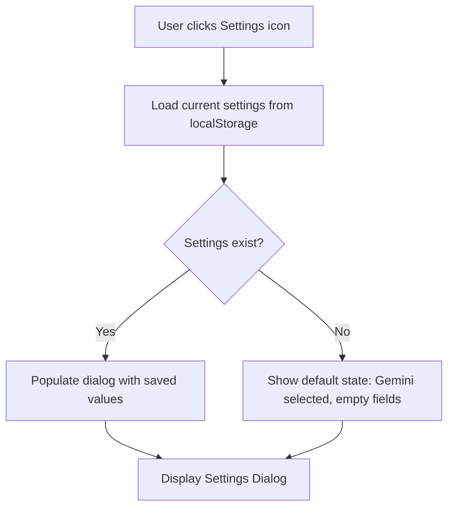
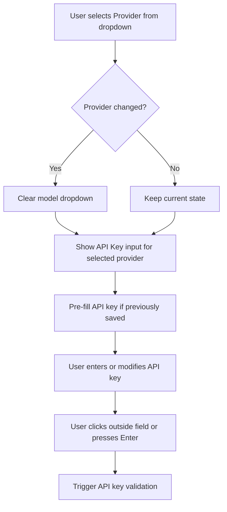
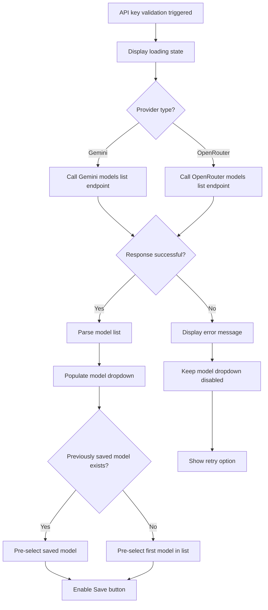
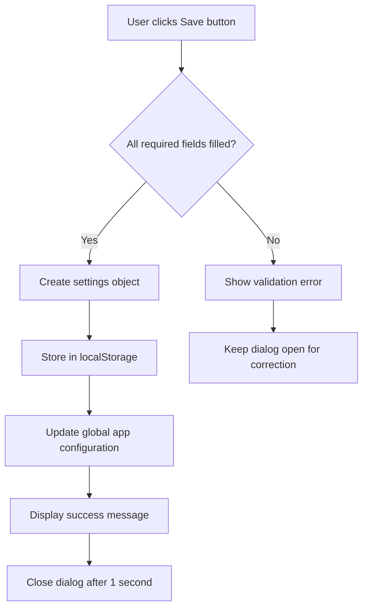

# Settings Dialog Implementation

## Overview

This design document outlines the implementation of a Settings Dialog that enables users to configure and switch between two AI providers: Google Gemini and OpenRouter. The dialog provides a centralized interface for API key management, model selection, and default provider configuration.

## Objectives

1. Enable users to choose between Gemini and OpenRouter as their AI provider
2. Securely store and manage API keys for both providers
3. Dynamically fetch and display available models for the selected provider
4. Allow users to set a default model for their project
5. Persist settings across browser sessions using localStorage
6. Integrate seamlessly with the existing Netlify serverless function architecture

## User Interface Design

### Settings Dialog Structure

The settings dialog is a modal overlay containing the following components:

#### Dialog Layout

| Component | Description |
|-----------|-------------|
| Header | Contains the title "Settings" and a close button |
| Provider Selection | Dropdown menu to choose between "Gemini" and "OpenRouter" |
| API Key Input | Conditional text input field (password type) for entering the API key |
| Model Selection | Conditional dropdown displaying available models (appears after successful API key validation) |
| Action Buttons | "Save" and "Cancel" buttons for confirming or discarding changes |
| Status Messages | Feedback area for displaying success, error, or loading states |

#### Visual States

**Initial State**
- Provider dropdown shows current selection or defaults to "Gemini"
- API Key field shows masked value if already saved, or empty placeholder
- Model dropdown is disabled until API key is validated
- Save button is enabled

**Loading State**
- Appears when fetching models after API key entry
- Model dropdown shows "Loading models..." message
- Save button is disabled during model fetch

**Success State**
- Model dropdown is populated with available models
- Current default model is pre-selected
- Success message displays "Settings saved successfully"

**Error State**
- Error message displays specific failure reason (invalid key, network error, etc.)
- Allows user to correct input and retry

### Access Point

The settings dialog is triggered via:
- A settings icon button in the application header (next to the "MOM Generator" title)
- Keyboard shortcut: Ctrl/Cmd + , (comma)

## Data Model

### Settings Configuration Object

The settings are stored in localStorage under the key `momGeneratorSettings` with the following structure:

| Field | Type | Description |
|-------|------|-------------|
| provider | String | Current AI provider: "gemini" or "openrouter" |
| geminiApiKey | String | Encrypted or plain API key for Gemini |
| openrouterApiKey | String | Encrypted or plain API key for OpenRouter |
| geminiDefaultModel | String | Selected Gemini model identifier |
| openrouterDefaultModel | String | Selected OpenRouter model identifier |
| lastUpdated | ISO String | Timestamp of last settings modification |

### Model Information Structure

Each model returned from the API contains:

| Field | Type | Description |
|-------|------|-------------|
| id | String | Unique model identifier |
| displayName | String | Human-readable model name |
| description | String | Brief description of model capabilities (optional) |
| maxTokens | Number | Maximum token limit (optional) |

## Functional Workflows

### Workflow 1: Opening Settings Dialog



### Workflow 2: Provider Selection and API Key Entry



### Workflow 3: Model Fetching and Validation



### Workflow 4: Saving Settings



## API Integration

### Gemini API Integration

**Endpoint for Model Listing**
- URL: `https://generativelanguage.googleapis.com/v1beta/models`
- Method: GET
- Authentication: API key as query parameter `?key={API_KEY}`

**Request Flow**
1. Append API key to endpoint URL
2. Send GET request
3. Parse response JSON array of model objects
4. Filter models supporting `generateContent` method
5. Extract model IDs and display names

**Response Structure**
The response contains an array of model objects with relevant fields:
- `name`: Full model identifier (e.g., "models/gemini-2.0-flash-exp")
- `displayName`: User-friendly name
- `supportedGenerationMethods`: Array indicating supported operations

### OpenRouter API Integration

**Endpoint for Model Listing**
- URL: `https://openrouter.ai/api/v1/models`
- Method: GET
- Authentication: Not required (public endpoint)

**Request Flow**
1. Send GET request to models endpoint (no authentication needed)
2. Parse response JSON containing models array
3. Extract model IDs and names from data array
4. Optionally display pricing and context length information

**Response Structure**
The response contains a `data` array with model objects:
- `id`: Model identifier (e.g., "google/gemini-2.5-pro-preview")
- `name`: Display name
- `context_length`: Maximum context window size
- `pricing`: Cost information object with `prompt` and `completion` fields
- `supported_parameters`: Array of supported parameters (e.g., "temperature", "top_p", "tools")

**Important Notes**
- This endpoint is edge-cached for performance
- Returns metadata for 400+ available models
- Can be called directly from frontend without API key for model discovery
- API key is only required for actual chat completion requests

## Backend Integration

### Modified Netlify Function

The existing `generate-mom.js` function requires modification to support dynamic provider selection.

#### Environment Variables Required

| Variable | Description |
|----------|-------------|
| GEMINI_API_KEY | Server-side Gemini API key (fallback/default) |
| OPENROUTER_API_KEY | Server-side OpenRouter API key (fallback/default) |

#### Function Input Parameters

The function accepts an enhanced request payload:

| Parameter | Type | Description |
|-----------|------|-------------|
| userQuery | String | The meeting notes and context (existing) |
| systemPrompt | String | The AI instruction template (existing) |
| provider | String | Selected provider: "gemini" or "openrouter" |
| model | String | Selected model identifier |
| apiKey | String | User-provided API key (optional, uses env var if absent) |

#### Provider-Specific Request Logic

**For Gemini Requests**
- Use existing Gemini API structure
- Replace hardcoded model with dynamic model parameter
- Endpoint: `https://generativelanguage.googleapis.com/v1beta/models/{MODEL}:generateContent`

**For OpenRouter Requests**
- Construct request to OpenRouter endpoint
- URL: `https://openrouter.ai/api/v1/chat/completions`
- Include required headers: Authorization, HTTP-Referer, X-Title, Content-Type
- Format request body with OpenAI-compatible structure:
  - `model`: Selected model ID
  - `messages`: Array with user message containing userQuery
  - System prompt integrated as system message or prepended to user message

**Response Normalization**
Both providers return different response structures. The function normalizes them to:

| Field | Type | Description |
|-------|------|-------------|
| whatsappMessage | String | Generated message text |
| actionItems | Array | List of action items |

## Security Considerations

### API Key Storage

**Client-Side Storage**
- API keys stored in localStorage are accessible to JavaScript
- Risk: Exposure through XSS attacks or browser extensions
- Mitigation: Warn users that keys are stored locally and not encrypted

**Server-Side Storage (Recommended Enhancement)**
- Store user API keys encrypted in Netlify environment variables or secure database
- Use session tokens to authenticate frontend requests
- Backend retrieves and uses keys on behalf of user
- Note: Requires user authentication system (future enhancement)

### Current Security Approach

Given the static site architecture:
1. Store API keys in localStorage (user accepts risk)
2. Always transmit keys over HTTPS to Netlify function
3. Netlify function validates and uses keys server-side
4. Never expose keys in client-side logs or error messages
5. Provide clear UI warning about key storage security

### API Key Validation

**Pre-Save Validation**
- Test API key with a minimal request before saving
- For Gemini: Fetch models list
- For OpenRouter: Fetch models list or make test completion request
- Only save key if validation succeeds

## Error Handling

### Error Scenarios and User Feedback

| Scenario | Error Message | User Action |
|----------|---------------|-------------|
| Invalid API key | "Invalid API key. Please check and try again." | Re-enter correct key |
| Network failure during model fetch | "Unable to connect. Check your internet connection." | Retry button available |
| No models returned | "No compatible models found for this API key." | Contact support or verify key permissions |
| Save failure (localStorage unavailable) | "Unable to save settings. Check browser storage permissions." | Enable localStorage |
| API rate limit exceeded | "Rate limit exceeded. Please wait and try again." | Retry after delay |

### Graceful Degradation

If settings cannot be loaded:
- Fall back to default Gemini configuration
- Use environment variable API key from Netlify function
- Display warning banner: "Settings unavailable, using default configuration"

## User Experience Enhancements

### Loading States

**Model Fetching**
- Show spinner icon in model dropdown
- Disable dropdown interaction during fetch
- Display text: "Fetching available models..."

**Save Operation**
- Disable save button during processing
- Change button text to "Saving..."
- Show success animation on completion

### Input Validation

**API Key Field**
- Mask input as password type
- Show/hide toggle button for verification
- Minimum length validation (provider-specific)
- Format validation if provider has specific patterns

**Model Selection**
- Disable until models are successfully fetched
- Show count of available models: "12 models available"
- Search/filter capability for long model lists

### Accessibility

- Keyboard navigation: Tab through all interactive elements
- Escape key closes dialog
- Focus trap within dialog when open
- ARIA labels for screen readers
- Clear focus indicators on all inputs

## Integration with Existing Application

### Changes to Main Application Flow

**On Application Initialization**
1. Load settings from localStorage
2. Set global configuration variables for provider and model
3. Display current provider in UI (optional status indicator)

**On Form Submission (Generate & Send)**
1. Retrieve current provider and model from settings
2. Include provider and model in Netlify function request payload
3. Use saved API key if available, otherwise fall back to environment variable

**Settings Synchronization**
- Settings changes take effect immediately upon save
- No application reload required
- Next AI generation request uses updated configuration

### UI Changes Required

**Header Section**
- Add settings gear icon button next to "MOM Generator" title
- Icon tooltip: "Settings (Ctrl+,)"

**Status Indicator (Optional)**
- Small badge showing current provider and model
- Example: "Using: Gemini (gemini-2.0-flash-exp)"
- Click to open settings dialog

## Testing Considerations

### Manual Testing Scenarios

1. **First-time user flow**
   - Open settings with no saved configuration
   - Enter Gemini API key and verify model fetch
   - Select model and save
   - Confirm settings persist after page reload

2. **Provider switching**
   - Open settings with Gemini configured
   - Switch to OpenRouter
   - Enter OpenRouter API key
   - Verify Gemini settings remain saved
   - Switch back to Gemini and confirm previous selection intact

3. **Invalid API key handling**
   - Enter incorrect API key
   - Verify error message displays
   - Confirm save button behavior
   - Correct API key and verify recovery

4. **Model selection**
   - Verify all models display correctly
   - Confirm default model pre-selection
   - Change model and save
   - Verify new default used in generation

5. **Settings persistence**
   - Configure settings and save
   - Close and reopen browser
   - Verify settings retained
   - Generate MOM and confirm correct provider/model used

### Edge Cases

- Empty API key submission attempt
- Network disconnection during model fetch
- localStorage quota exceeded
- Concurrent tab modifications to settings
- API key with special characters
- Very long model lists (100+ models)

## Implementation Reference

### HTML Structure for Settings Button

Add to header section to trigger settings dialog:

```html
<header class="mb-6 flex justify-between items-center">
    <h1 class="text-3xl font-bold text-gray-800">MOM Generator</h1>
    <button id="settings-btn" class="text-gray-600 hover:text-indigo-600 transition-colors" title="Settings">
        <svg xmlns="http://www.w3.org/2000/svg" width="28" height="28" viewBox="0 0 24 24" fill="none" stroke="currentColor" stroke-width="2">
            <circle cx="12" cy="12" r="3"></circle>
            <path d="M12 1v6m0 6v6"></path>
        </svg>
    </button>
</header>
```

### HTML Structure for Settings Modal

Add after existing modals in HTML:

```html
<div id="settings-modal" class="modal-overlay">
    <div class="modal-content relative" style="max-width: 600px;">
        <button id="settings-modal-close" class="modal-close-btn">
            <svg><!-- Close icon --></svg>
        </button>
        
        <h2 class="text-2xl font-bold text-gray-800 mb-6">Settings</h2>
        
        <form id="settings-form">
            <!-- Provider dropdown -->
            <div class="mb-5">
                <label for="ai-provider">AI Provider</label>
                <select id="ai-provider" class="form-input">
                    <option value="gemini">Google Gemini</option>
                    <option value="openrouter">OpenRouter</option>
                </select>
            </div>
            
            <!-- API Key input with visibility toggle -->
            <div class="mb-5">
                <label for="api-key-input">API Key</label>
                <div class="relative">
                    <input type="password" id="api-key-input" class="form-input">
                    <button type="button" id="toggle-api-key-visibility">
                        <!-- Eye icon -->
                    </button>
                </div>
            </div>
            
            <!-- Model selection dropdown -->
            <div class="mb-5">
                <label for="model-select">Default Model</label>
                <select id="model-select" class="form-input" disabled>
                    <option>Enter API key to load models...</option>
                </select>
            </div>
            
            <!-- Status messages area -->
            <div id="settings-status-message" class="hidden"></div>
            
            <!-- Action buttons -->
            <div class="flex gap-3">
                <button type="button" id="settings-cancel-btn" class="btn btn-secondary">Cancel</button>
                <button type="submit" id="settings-save-btn" class="btn btn-primary">Save Settings</button>
            </div>
        </form>
    </div>
</div>
```

### JavaScript Settings Management

#### Settings State Object

```javascript
let appSettings = {
    provider: 'gemini',
    geminiApiKey: '',
    openrouterApiKey: '',
    geminiDefaultModel: 'gemini-2.0-flash-exp',
    openrouterDefaultModel: '',
    lastUpdated: null
};
```

#### Load and Save Settings

```javascript
function loadSettings() {
    const saved = localStorage.getItem('momGeneratorSettings');
    if (saved) {
        appSettings = { ...appSettings, ...JSON.parse(saved) };
    }
}

function saveSettings() {
    appSettings.lastUpdated = new Date().toISOString();
    localStorage.setItem('momGeneratorSettings', JSON.stringify(appSettings));
}
```

#### Fetch Gemini Models

```javascript
async function fetchGeminiModels(apiKey) {
    const url = `https://generativelanguage.googleapis.com/v1beta/models?key=${apiKey}`;
    const response = await fetch(url);
    
    if (!response.ok) {
        throw new Error('Invalid API key or network error');
    }
    
    const data = await response.json();
    return data.models
        .filter(m => m.supportedGenerationMethods?.includes('generateContent'))
        .map(m => ({
            id: m.name.replace('models/', ''),
            displayName: m.displayName || m.name
        }));
}
```

#### Fetch OpenRouter Models

```javascript
async function fetchOpenRouterModels() {
    const response = await fetch('https://openrouter.ai/api/v1/models');
    const data = await response.json();
    
    return data.data.map(m => ({
        id: m.id,
        displayName: m.name || m.id,
        contextLength: m.context_length,
        pricing: m.pricing
    }));
}
```

#### Update Provider-Aware API Call

```javascript
async function callAI(userQuery, systemPrompt) {
    const payload = {
        userQuery,
        systemPrompt,
        provider: appSettings.provider,
        model: appSettings.provider === 'gemini' 
            ? appSettings.geminiDefaultModel 
            : appSettings.openrouterDefaultModel,
        apiKey: appSettings.provider === 'gemini' 
            ? appSettings.geminiApiKey 
            : appSettings.openrouterApiKey
    };
    
    const response = await fetch('/.netlify/functions/generate-mom', {
        method: 'POST',
        headers: { 'Content-Type': 'application/json' },
        body: JSON.stringify(payload)
    });
    
    return await response.json();
}
```

### Updated Netlify Function Structure

The function needs to handle both providers:

```javascript
exports.handler = async (event) => {
    const { userQuery, systemPrompt, provider, model, apiKey } = JSON.parse(event.body);
    
    // Use user-provided key or fall back to environment variable
    const effectiveApiKey = apiKey || (provider === 'gemini' 
        ? process.env.GEMINI_API_KEY 
        : process.env.OPENROUTER_API_KEY);
    
    if (provider === 'gemini') {
        return await handleGeminiRequest(userQuery, systemPrompt, model, effectiveApiKey);
    } else if (provider === 'openrouter') {
        return await handleOpenRouterRequest(userQuery, systemPrompt, model, effectiveApiKey);
    }
};
```

#### Gemini Request Handler

```javascript
async function handleGeminiRequest(userQuery, systemPrompt, model, apiKey) {
    const url = `https://generativelanguage.googleapis.com/v1beta/models/${model}:generateContent?key=${apiKey}`;
    
    const response = await fetch(url, {
        method: 'POST',
        headers: { 'Content-Type': 'application/json' },
        body: JSON.stringify({
            contents: [{ parts: [{ text: userQuery }] }],
            systemInstruction: { parts: [{ text: systemPrompt }] },
            generationConfig: {
                responseMimeType: "application/json",
                responseSchema: {
                    type: "OBJECT",
                    properties: {
                        whatsappMessage: { type: "STRING" },
                        actionItems: { type: "ARRAY", items: { type: "STRING" } }
                    }
                }
            }
        })
    });
    
    const result = await response.json();
    const parsedResponse = JSON.parse(result.candidates[0].content.parts[0].text);
    
    return {
        statusCode: 200,
        body: JSON.stringify(parsedResponse)
    };
}
```

#### OpenRouter Request Handler

```javascript
async function handleOpenRouterRequest(userQuery, systemPrompt, model, apiKey) {
    const response = await fetch('https://openrouter.ai/api/v1/chat/completions', {
        method: 'POST',
        headers: {
            'Authorization': `Bearer ${apiKey}`,
            'HTTP-Referer': process.env.SITE_URL || 'http://localhost',
            'X-Title': 'MOM Generator',
            'Content-Type': 'application/json'
        },
        body: JSON.stringify({
            model: model,
            messages: [
                { role: 'system', content: systemPrompt },
                { role: 'user', content: userQuery }
            ],
            response_format: { type: 'json_object' }
        })
    });
    
    const result = await response.json();
    const parsedResponse = JSON.parse(result.choices[0].message.content);
    
    return {
        statusCode: 200,
        body: JSON.stringify(parsedResponse)
    };
}
```

### Event Handlers Setup

```javascript
// Open settings modal
document.getElementById('settings-btn').addEventListener('click', () => {
    document.getElementById('settings-modal').style.display = 'flex';
    // Populate current settings
});

// Provider change handler
document.getElementById('ai-provider').addEventListener('change', (e) => {
    const provider = e.target.value;
    // Update UI labels and load saved key
});

// API key blur handler - fetch models
document.getElementById('api-key-input').addEventListener('blur', async () => {
    const apiKey = document.getElementById('api-key-input').value.trim();
    const provider = document.getElementById('ai-provider').value;
    
    if (apiKey) {
        const models = provider === 'gemini' 
            ? await fetchGeminiModels(apiKey)
            : await fetchOpenRouterModels();
        // Populate model dropdown
    }
});

// Save settings
document.getElementById('settings-form').addEventListener('submit', (e) => {
    e.preventDefault();
    // Save to appSettings and localStorage
});

// Keyboard shortcut (Cmd/Ctrl + ,)
document.addEventListener('keydown', (e) => {
    if ((e.ctrlKey || e.metaKey) && e.key === ',') {
        e.preventDefault();
        // Open settings
    }
});
```

## Future Enhancements

1. **Multi-user support**
   - User authentication system
   - Server-side encrypted key storage
   - Per-user configuration profiles

2. **Advanced model configuration**
   - Temperature and token limit controls
   - Custom system prompt templates per provider
   - Model performance comparison metrics

3. **Key rotation and management**
   - API usage tracking and statistics
   - Key expiration warnings
   - Multiple key profiles for different environments

4. **Provider extensibility**
   - Plugin architecture for additional AI providers
   - Custom API endpoint configuration
   - Provider-specific feature toggles

5. **Backup and export**
   - Export settings as JSON file
   - Import settings from file
   - Sync settings across devices via cloud storage
