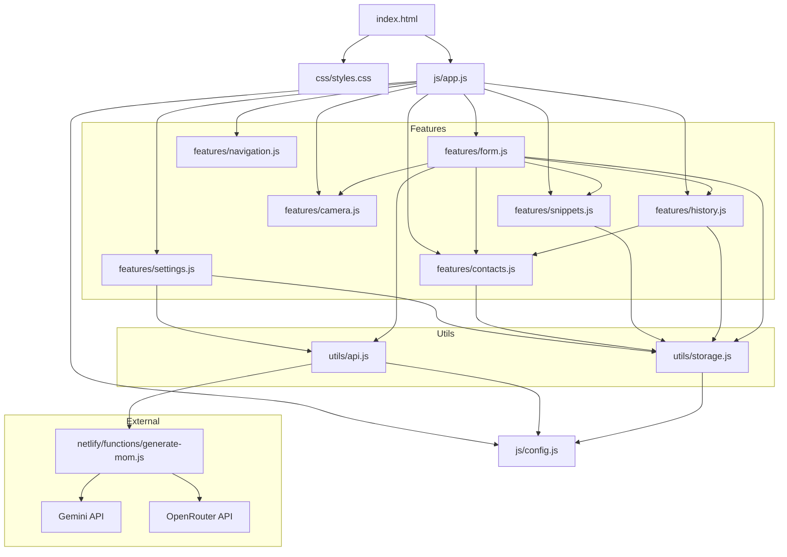

# MOM Generator - Module Architecture

## Architecture Diagram



## Dependency Flow

```
app.js (Entry Point)
  │
  ├─> SettingsManager
  │     └─> storage.js, api.js
  │
  ├─> ContactManager
  │     └─> storage.js
  │
  ├─> SnippetManager
  │     └─> storage.js
  │
  ├─> CameraManager
  │
  ├─> HistoryManager (depends on ContactManager)
  │     └─> storage.js
  │
  ├─> NavigationManager
  │
  └─> FormManager (depends on all above)
        └─> storage.js, api.js
```

## Data Flow

```
User Input (Form)
  │
  ├─> FormManager.handleSubmit()
  │     │
  │     ├─> SnippetManager.findSnippet()
  │     ├─> api.callGeminiAPI()
  │     │     └─> Netlify Function
  │     │           └─> AI Provider (Gemini/OpenRouter)
  │     │
  │     ├─> ContactManager.saveContact()
  │     │     └─> storage.saveContacts()
  │     │
  │     ├─> HistoryManager.addMeeting()
  │     │     └─> storage.saveMeetingHistory()
  │     │
  │     └─> Open WhatsApp with generated message
  │
  └─> Display Results
```

## Module Responsibilities

### Core
- **app.js**: Orchestration & initialization
- **config.js**: Constants & configuration

### Features (UI + Logic)
- **settings.js**: API configuration
- **form.js**: Main business logic
- **contacts.js**: Contact CRUD
- **snippets.js**: Template management
- **camera.js**: Media capture
- **history.js**: Meeting logs
- **navigation.js**: UI navigation

### Utils (Helpers)
- **storage.js**: Data persistence
- **api.js**: Network communication
